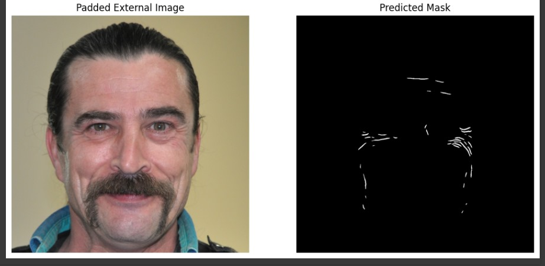

# 🧠 UNet with ResNet34 Backbone for Wrinkle Segmentation

This repository contains a high-performance semantic segmentation pipeline using a **U-Net architecture** with a **ResNet34 encoder**, specifically trained to identify **facial wrinkles** in high-resolution images. The model achieves **≈98% pixel-level accuracy**, demonstrating state-of-the-art performance in wrinkle detection for cosmetic and dermatological applications.

## 🚀 Highlights
- 🎯 **Task**: Binary semantic segmentation of wrinkles in facial images  
- 🧠 **Model**: U-Net with ResNet34 backbone (pretrained on ImageNet)  
- 💻 **Framework**: PyTorch + segmentation_models.pytorch  
- 🎨 **Output**: Transparent overlays highlighting wrinkle regions  
- 📊 **Accuracy**: ~98% pixel accuracy (val set)  
- ⚡ **Inference**: Optimized for fast CPU & GPU performance  
- 🌍 **Live Demo**: [Try it on Hugging Face Spaces](https://huggingface.co/spaces/RihemXX/wrinkle-segmentation-unet)


---

## 🧬 Dataset

We used a curated dataset of facial images with manually annotated wrinkle regions.

- 📂 **Download Dataset**: [Wrinkle Segmentation Dataset](https://github.com/labhai/ffhq-wrinkle-dataset) *(placeholder, replace with actual dataset URL)*

Each image includes:
- RGB facial images
- Binary mask annotations indicating wrinkle regions

---

## 🧠 Model Overview

The model uses the encoder-decoder design:

- **Encoder**: Pretrained ResNet34 backbone extracts hierarchical features
- **Decoder**: Symmetric upsampling layers reconstruct segmentation maps
- **Activation**: Sigmoid + Binary Thresholding at inference

**Loss Function**: BCE + Dice Loss  
**Optimizer**: Adam  
**Learning Rate**: 1e-4  
**Epochs**: 50  
**Augmentation**: Horizontal Flip, Random Crop, CLAHE

---

## 📊 Training Performance


---

## 🖼️ Example Inference Output

### Input Image → Predicted Mask → Overlay

<p float="left">
  
  
</p>

---

## 🧰 How to Use

1. Clone the repository:
   ```bash
   git clone https://github.com/YOUR_USERNAME/wrinkle-segmentation.git
   cd wrinkle-segmentation
